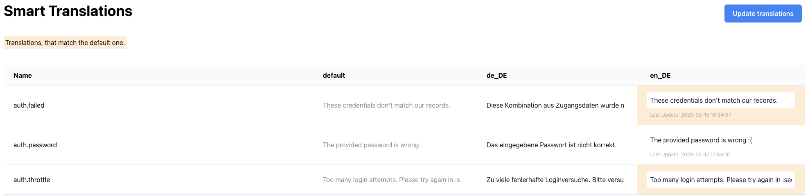

# Laravel Translation Manager

[](https://packagist.org/packages/empuxa/translation-manager)
[](https://github.com/empuxa/translation-manager/actions/workflows/run-tests.yml)
[](https://packagist.org/packages/empuxa/translation-manager)


This package provides a web interface to manage your Laravel application translations.
While the concept is heavily inspired by [barryvdh/laravel-translation-manager](https://github.com/barryvdh/laravel-translation-manager), this package is a complete rewrite with a different approach to provide a better non-developer user experience:

- there is a non-editable default language, to separate development from translation
- it can export to sub-folders: for example, you can now have a `lang/en/dashboard/charts.php` file
- all translation strings are on one page, that's based on Tailwind CSS
- it has (some) tests 🫣

However, currently there are also some disadvantages (feel free to contribute!):
- it does only read and export PHP files, no JSON
- vendor translations are not supported
- since all strings are on one page, big projects might have performance issues



## Installation

This package requires Laravel 9.33+.
You can install the package via composer:

```bash
composer require empuxa/translation-manager
```

Afterward, copy the vendor files:

```bash
php artisan vendor:publish --provider="Empuxa\TranslationManager\ServiceProvider"
```

Finally, run the migrations:

```bash
php artisan migrate
```

Don't forget to also update the config file `config/translation-manager.php` to your needs!

## Usage
### Local Storage / Single Server Setup
By default, the translation manager is available at `/translation-manager`. However, you can change the route in the config file. Before you can edit translations, you must also set up the output languages. The default language isn't editable to separate development and translation.

To push the translations into the database, you need to run the following command:

```bash
php artisan translation-manager:push-to-db
```

It's now possible to edit any language string via the web interface and save them to the database. If a language string already exists, it won't be overwritten. You can force that behavior by using the `--force` flag.

Before you can use the translations in your application, you need to export them to PHP files that will get stored in the `lang` folder. You can do that by running the following command:

```bash
php artisan translation-manager:pull-from-db
```

### Cloud Storage / Multi Server Setup
The best way to use the translation manager in a cloud setup is to run a single server instance, where the translators can edit the translations. However, you might also want to push the translations to other environments. That's where cloud storage comes into play. 

By using the `translation-manager:push-to-storage` command, you can push any lang file to the storage disk defined in the config. With the `translation-manager:pull-from-storage` command, you can then pull the translations from the storage disk.

## Testing

```bash
composer test
```

## Changelog

Please see [CHANGELOG](CHANGELOG.md) for more information on what has changed recently.

## Security Vulnerabilities

Please review [our security policy](../../security/policy) on how to report security vulnerabilities.

## Credits

- [Marco Raddatz](https://github.com/marcoraddatz)
- [All Contributors](../../contributors)

## License

The MIT License (MIT). Please see [License File](LICENSE.md) for more information.
